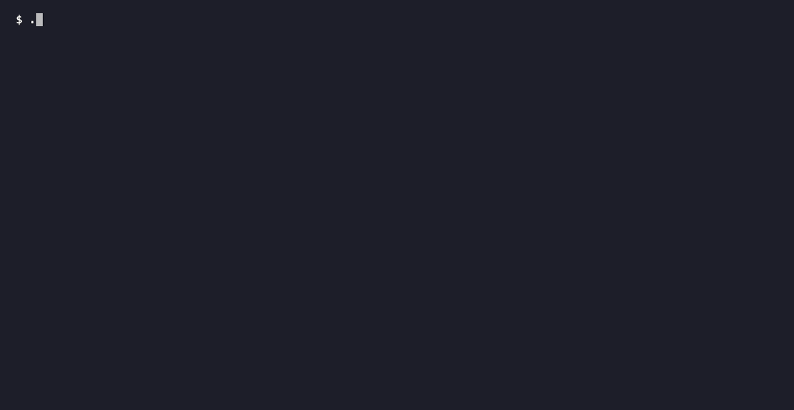

# codegraph-kit — a standalone code knowledge-graph MCP server and KG-only coding agents

[](https://github.com/shekharnair96/codegraph-kit/actions/workflows/test.yml)
[](https://www.npmjs.com/package/codegraph-kit)
[](LICENSE)

Point the **CodeGraph** MCP server at any TypeScript/JavaScript repo, then hand scoped changes to
one of two **KG-only** coding agents. The agents discover code *only* through the knowledge graph —
no grep, no file listing, no shell. That restriction is the whole idea, and it is enforced by the
host's tool allowlist rather than requested in a prompt.



*Replay of a real, captured run — no Read/Grep/Bash tools in the allowlist, only `mcp__codegraph__*`
plus Edit/Write/MultiEdit (unused here). See [`demo/README.md`](demo/README.md) for the raw stream.*

**Known issue (being reconciled):** the GIF above and the task-B `kg-sonnet` row in the table below
were captured from two different runs of the same task, on different dates, and currently disagree
on turns/cost/tokens. A fresh, single canonical run is being captured to back both; until then,
treat the numbers as unreconciled.

## What that buys you

Two scoped tasks on [react-hook-form](https://github.com/react-hook-form/react-hook-form) (v7.87.0,
120 jest suites, 1,302 tests), run headless through Claude Code on a clean tree, suite verified green
afterwards. Same prompt both arms; `kg-sonnet` is this kit's agent, `baseline` is plain Sonnet with
Read/Grep/Glob/Edit and jest via Bash:

| run | suite after | turns | cost (USD) | input tokens |
|---|---|---|---|---|
| **A** add a prototype-pollution guard — `kg-sonnet` | PASS 1302/1302 | **9** | **0.12** | **65k** |
| **A** baseline | PASS 1302/1302 | 11 | 0.27 | 217k |
| **B** rename with a substring trap — `kg-sonnet` | PASS 1302/1302 | 18 | **0.13** | **64k** |
| **B** baseline | PASS 1302/1302 | 18 | 0.22 | 354k |

The gap that matters is the input-token column, and it comes from `plan`/`impact`/`read` returning
exactly the relevant sites instead of whole files and grep sweeps. It widens with repo size: on a
28-file repo the same comparison is roughly a wash, and on one task the baseline was *cheaper*.

Reproduce it yourself — prompts, diffs, per-run tool breakdowns and the exact commands are in
[`demo/README.md`](demo/README.md) (eight runs, two public repos, one sample per cell, not a
benchmark). The honest version of the story is there too, including the run where the KG agent
burned 11 failed `Edit` attempts before recovering.

## How this differs from other code-indexing MCP servers

Most of them stop at discovery: they index a repo and expose search or symbol lookup, and the agent
does the editing with its ordinary file tools. This kit is built around the other half of the loop.

- **Editing and verification are first-class graph tools.** `apply_edit_at_site` edits by
  `(file, line)` — no whole-file read to build an anchor — batched and atomic; `apply_literal`
  scopes a value swap to one symbol's span so changing one metric's color can't leak into siblings;
  `verify` returns a single PASS/FAIL over the affected tests for the whole diff, memoized.
- **The restriction is enforced, not suggested.** The kit ships agent definitions whose tool
  allowlist contains the `codegraph_*` tools and nothing else. On hosts that support it
  (Claude Code, OpenCode, Code Puppy) the model *cannot* grep — see the support table below for
  which hosts can and can't.
- **It's self-contained.** The indexer is included, the server has zero runtime dependencies, and
  there's no service to run, no CLI to download, and no build step.

The enforcement point is not a detail. **KG-*preferred* — the graph available with grep and read as
a fallback — does not work.** Given the choice, the model greps, reads, ignores the graph, and the
numbers revert to the baseline. That negative result is why the agents are configured the way they
are.

## Quick start

```bash
npm install codegraph-kit
node_modules/codegraph-kit/install.sh /abs/path/to/your/repo
```

That indexes the repo and wires up whichever MCP host you have (Claude Code, OpenCode, Cursor,
Codex CLI, Code Puppy — auto-detected). Then, from inside that repo:

```
Use the kg-sonnet subagent to rename getFieldValue to readFieldValue everywhere.
Fix any tests this breaks. Leave getFieldValueAs alone.
```

You need Node ≥ 18 and a `sqlite3` on your PATH. Full details in
[Requirements](#requirements) and [Install](#install-once-per-repo) below.

## The experiment behind it

Before the public demos above, the same comparison ran as a controlled A/B on a private repo across
model × tooling, correct and tests green in every kept cell. The headline: KG-only Sonnet was the
cheapest correct cell in the grid, using ~3.5× fewer tool calls and ~10× fewer tokens than the same
model with grep/read; KG-only Opus took the fewest turns but cost ~4× that.

The more useful finding is about *when* the graph helps. At **n=5 per cell** across three task
tiers, the two arms separate in different ways:

- **Ambiguous change-location** — the only tier where the plain agent fails outright, and it fails by
  *never converging*: 0/5 within a 900s kill, vs 4/5 correct with the graph (Fisher p=0.048).
- **Wide-mechanical** — both arms get it right 5/5. The graph buys cost and consistency, not
  correctness: **$0.23 vs $0.80**, and exactly 7 turns on every single run vs 18–58
  (Mann-Whitney on turns, p=0.0079).
- **Trivial one-constant edits** — a genuine null, and at this sample size not certifiable either
  way. A plain agent is fine.

The mechanism is the interesting part, and it revises the obvious intuition: the payoff tracks
**scope ambiguity, not blast radius**. The widest-fan-out tier is the one the plain agent handles
fine.

Those are small samples on one repo, and the underlying data isn't public — treat them as the
motivation for the design, and the reproducible demo above as the evidence. Full write-up:
[`docs/experiment.md`](docs/experiment.md) (rendered as [`docs/report.html`](docs/report.html)),
slide deck [`docs/deck.html`](docs/deck.html), charts in [`docs/figures/`](docs/figures/), design
notes in [`docs/ARCHITECTURE.md`](docs/ARCHITECTURE.md).

## The tools

Each MCP tool shells out to a small, single-purpose `.cjs` CLI under [`codegraph-ext/`](codegraph-ext/),
so there is **one source of truth** for the logic whether you call it as an MCP tool or from the
shell. The target repo is resolved per call as `projectRoot` arg → cwd autodetect → `$CODEGRAPH_ROOT`.

### Discovery (read)

| Tool | What it answers |
|------|-----------------|
| `codegraph_locate` | Turn a *concept* ("graph series color", a hex literal) into ranked candidate **symbols** — searches names, qualified names, docstrings, signatures **and bodies** (identifiers + literals). |
| `codegraph_plan` | The pre-scoped **edit set** for a symbol change: definition + references + covering tests + literal-assert sites, each with the current line inline. |
| `codegraph_impact` | Raw blast-radius set for a symbol (def + prod refs + covering tests + literal-assert sites). |
| `codegraph_read` | The **relevant slices** of many files in ONE call — feed it the `file:line` list from `plan`; a short range auto-expands to its enclosing function/class. |

### Edit + verify (write)

| Tool | What it does |
|------|--------------|
| `codegraph_apply_edit_at_site` | Edit **by (file, line)** — the server fetches that line's context itself, so no whole-file read to build an anchor. Batched, atomic, verifies once. The default edit path. |
| `codegraph_apply` | Apply many **anchored** `old → new` replacements across files in ONE atomic call (all-or-nothing). |
| `codegraph_apply_literal` | One-shot `oldValue → newValue` swap **scoped to a symbol's span**, so changing one metric's color can't leak into siblings. |
| `codegraph_verify` | ONE compact PASS/FAIL verdict over the affected tests for the whole working-tree diff. **Memoized** — unchanged green suites are skipped. |
| `codegraph_test_one` | The raw-output escape hatch: run one test file (optional `-t` name filter) and get the runner’s full output, only when a failure is genuinely gnarly. |

---

## What's in the box

```
codegraph-kit/
  codegraph-ext/        the tooling: MCP server (codegraph-mcp.cjs), query/verify/apply
                        scripts, DB overlays (augment/build-body-index), starter annotations.json
    engine/             the indexer — walks TS/JS with the TypeScript compiler API and writes
                        .codegraph/codegraph.db
  agents/
    kg-coder.prompt.md  the KG-only system prompt — the ONE source of truth
    manifest.json       the two tiers (name, description, per-host model id)
    kg-sonnet.json      Code Puppy rendering, Sonnet (cost-optimal default choice)
    kg-opus.json        Code Puppy rendering, Opus (fewest turns, ~4× cost)
  install/              host adapters + test-runner detection (verify.config.json)
  test/                 the end-to-end tests (`npm test`)
  test-fixture/         a small TS/TSX/JS project the tests index and query
  docs/                 deck + experiment figures
  install.sh            point everything at a repo (idempotent)
  README.md
```

## Requirements

- **Node ≥ 18**.
- The **`sqlite3` command-line tool** on your PATH (the indexer writes the graph through it).
- **An agent host that speaks MCP.** The installer auto-detects and wires up whichever of Claude
  Code / OpenCode / Code Puppy / Cursor / Codex CLI you have; with none of them it prints a generic
  registration snippet you can paste anywhere. No host is mandatory.
- The target repo must have a working local **test runner** (the agent's `verify` runs it).
  **jest and vitest are both supported.** The installer *derives* the command from your own
  `scripts.test` and writes it to `codegraph-ext/verify.config.json`, so `verify` runs the suite
  `npm test` runs — a repo whose tests only work under `jest --config ./scripts/jest/jest.config.js`
  gets exactly that, not a bare `npx jest` judging some other set of files. It then proves the
  derived command once, against a real test file, before calling the install done:

  ```
  ==> [3/5] derive the test runner from this repo's own `npm test`
      derived from `jest --config ./scripts/jest/jest.config.js`  ->  npx jest --config ./scripts/jest/jest.config.js
      probe: src/__tests__/controller.server.test.tsx -> 2 test(s) reported
  ```

  Watch/coverage/reporter flags are stripped (the kit supplies its own reporter and file list);
  config, rootDir, projects and worker flags are kept, as is anything it doesn't recognise.

  **If your runner isn't one it can express, it writes nothing and tells you why** — `node --test`,
  mocha, `turbo run test`, or a command that needs an environment variable
  (`NODE_OPTIONS=--experimental-vm-modules jest`) are all refused rather than guessed at, because a
  runner that's silently wrong produces a *verdict about the wrong suite*. Write the file yourself
  in that case, and it will never be overwritten:

  ```json
  { "runner": ["vitest", "run"] }
  ```

  The first element is the npx-resolved binary and the rest are fixed args placed before ours —
  so `["jest", "--config", "jest.unit.config.js"]` works too. Only the machine-readable-report
  flag differs between the two families (`--json` vs `--reporter=json`); the kit picks it from the
  binary name. Everything downstream is shared, because vitest's json reporter emits jest's result
  schema, and `-t` means the same thing in both. Any other runner needs the report translated —
  `verify` will say `produced no parseable result`.

  `./install.sh --check <repo>` re-runs that probe, so a runner that has drifted shows up as
  `[MISSING] test runner produces no parseable report` instead of as a green verdict later.

(No python. No specific host. The installer is plain Node.)

## Supported hosts

The thesis of this kit is **starvation**: the agent gets no grep, no read, no shell, so it has to
use the graph. Hosts that can express a tool allowlist get that enforced; the rest get the MCP
server plus a prompt file that only *asks* for it.

| Host | What gets installed | KG-only enforced? | Verified end to end |
|---|---|---|---|
| **Claude Code** | project `.mcp.json` + `.claude/agents/kg-{sonnet,opus}.md` subagents whose `tools:` list is exactly the `codegraph_*` MCP tools + `Edit, Write, MultiEdit` | **yes** | **yes** — needs `--strict-mcp-config` headless, or one-time approval interactively |
| **OpenCode** | `opencode.json` → `mcp.codegraph` + `agent.kg-{sonnet,opus}` with `tools` disabling bash/read/grep/glob/list/webfetch | **yes** | **yes** — no approval step |
| **Codex CLI** | `$CODEX_HOME/config.toml` `[mcp_servers.codegraph]` + an `AGENTS.md` section | no — no tool allowlist | **yes** — requires `codex exec --approve-for-me` (see below) |
| **Code Puppy** | `~/.code_puppy/{mcp_servers,mcp_agent_bindings}.json` + `agents/kg-{sonnet,opus}.json` | **yes** | config only — not yet run against a live model |
| **Cursor** | `.cursor/mcp.json` + `.cursor/rules/codegraph-kg-only.mdc` | no — rules can't restrict tools | config only — not yet run against a live model |
| **anything else** | prints the stdio command, an `mcpServers` JSON snippet and the prompt path | you wire it | — |

"Verified end to end" means: the host actually spawned the server *and* the model called a
`codegraph_*` tool and got the right answer back. Every adapter's configured command is checked in
CI (`test/hosts.test.cjs` spawns it and asserts `tools/list` returns all 10 tools), so "config only"
means the server launches and handshakes — just that no live model run has confirmed the rest.

**Codex CLI needs `--approve-for-me`.** Any other headless mode leaves approval policy at `never`,
which *denies* MCP tool calls rather than auto-allowing them — you get `MCP tool call requires
approval, but approval policy is never` and the model answers from nothing. Marking the server
`trust_level = "trusted"` does not help; the gate is session-level, not per-server.

On Cursor and Codex CLI expect the model to grep anyway — that's the KG-*preferred* arm, which this
kit measured and found reverts to the non-KG baseline. Use them for the graph tooling, not for the
cost result. Config formats and the docs they were verified against: [`install/README.md`](install/README.md).

The indexer is included: `codegraph-ext/engine/`, plain Node, TS/JS via the TypeScript compiler
API. It has two npm dependencies (`typescript`, `ts-morph`), declared as the kit's own so your
package manager installs them normally — nothing needs to be on your PATH and there is no CLI to
download.

If `ts-morph` can't be resolved when the overlays are built, `install.sh` **won't fail** — it
just skips the props/docs/test-linkage/annotation overlays. Core discovery
(`locate`/`plan`/`trace`/`impact`/`apply`/`verify`) works either way.

## Get the kit

From npm:

```bash
npm install codegraph-kit
# then: node_modules/codegraph-kit/install.sh /abs/path/to/repo-or-subdir
```

or from a clone:

```bash
git clone https://github.com/shekharnair96/codegraph-kit.git
cd codegraph-kit && npm install
```

Either way `typescript` and `ts-morph` come along as ordinary dependencies — there's no build step
and no postinstall script.

## Install (once per repo)

```bash
./install.sh /abs/path/to/repo-or-subdir                # auto-detect your host(s)
./install.sh /abs/path/to/repo-or-subdir --host claude   # or name them
./install.sh /abs/path/to/repo-or-subdir --host claude,opencode
```

`repo-or-subdir` = the directory that holds your source (usually where `package.json` lives; for
a monorepo, the package you want indexed).

What it does: copies `codegraph-ext/` into the repo, builds the graph DB (index + overlays), then
registers the `codegraph` MCP server and installs the two KG-only agents for every host it detects
(`--host auto` is the default; `--host none` just prints the snippet). It finishes with a
host-specific "here's how to invoke it" note.

Every merge is idempotent and preserves your existing servers, agents and config keys; the first
time it modifies a pre-existing file it saves a `.bak-<timestamp>` copy beside it.

Run it again for other repos — each repo gets its own `codegraph-ext/` + `.codegraph/` DB.

Check a repo any time without changing anything:

```bash
./install.sh --check /abs/path/to/repo
```

## Send work to an agent

From **inside the repo you're working on**, just send the task — no path needed. The agent
**auto-detects the repo from your current working directory** (it walks up to the nearest indexed
repo).

**Claude Code** — restart it in the repo, approve the project MCP server, then:

```
Use the kg-sonnet subagent to change the primary chart series color to #FF6B6B and set its
line width to 3. Fix any tests this breaks. Don't touch the dashed comparison series.
```

(`/agents` lists `kg-sonnet` and `kg-opus`.)

**OpenCode**:

```
@kg-sonnet change the primary chart series color to #FF6B6B and set its line width to 3,
and fix any tests this breaks
```

**Code Puppy**:

```
/agent kg-sonnet
Change the primary chart series color to #FF6B6B and set its line width to 3.
Fix any tests this breaks. Don't touch the dashed comparison series.
```

Or from an orchestrator:

```python
invoke_agent(agent_name="kg-sonnet",
             prompt="<scoped change>. Fix broken tests.")
```

**Cursor / Codex CLI** have no tool-restricted agents — the `codegraph_*` tools are there, and the
installed rule (`@codegraph-kg-only`) / `AGENTS.md` section asks for the KG-only workflow, but
nothing stops the model grepping.

You only pass an absolute path when you want to target a **different** repo — e.g. "In
`/abs/path/to/other-repo`, \<scoped change\>. Fix broken tests."

Pick `kg-sonnet` to save money, `kg-opus` to minimize turns.

### Good tasks for these agents
Scoped, symbol-level changes: change a constant/color/value, rename, adjust a function's
behavior, and fix the tests that break. They shine when the change location is **ambiguous** and the
graph can pinpoint the edit set — that's where a plain agent can fail to converge at all. On
wide-mechanical find-and-replace work a plain agent also succeeds; the graph just does it for a
fraction of the cost and with far less run-to-run variance.

### Weak spots (know before you send)
- **JSX/prop wiring** the graph doesn't track — if a value flows through a component prop,
  `trace` from a leaf component can dead-end. The agent is told to trace from the shared
  component's *config* symbol instead, but deeply prop-threaded changes are harder.
- **Brand-new files / greenfield** — there's nothing to discover; a normal agent is fine.
- **Trivial single-constant edits** — no measurable benefit; the indexing is overhead.
- **Small repos generally** — the token advantage comes from not reading whole files, so it grows
  with repo size. On a 28-file project the comparison is roughly a wash.

## Run the tests

```bash
npm test
```

from the repo root — `npm test` names the files explicitly, which is the only form that works.
Bare `node --test` and `node --test test/` both misfire: Node ≥ 22 treats positional arguments as
glob patterns (a bare directory matches nothing and is then loaded as a module), and Node's default
discovery claims every `test-*.cjs` in the tree — which here means the `test-one` / `test-affected`
CLI scripts, not tests.

`test/fixture.test.cjs` copies `test-fixture/` to a temp dir, indexes it, builds
the overlays, and asserts the graph shape plus `locate`/`trace`/`plan` output end to end.
`test/runner.test.cjs` pins the jest/vitest adapter: which flags each family gets, and — against a
real captured vitest report — that every field `cg:verify` reads is still where it expects it.
`test/budget.test.cjs` drives the real MCP server over stdio against two indexed fixture copies and
asserts the three properties of the per-task call budget: a runaway loop still hits the wall, an
idle gap resets the budget so a new task isn't punished for the last one's usage, and exhausting one
repo's budget doesn't block another's.
`test/hosts.test.cjs` runs `install.sh` against a temp repo with `HOME`/`CODEX_HOME` redirected to a
temp dir and asserts every host config parses, that the Claude subagent allowlist really does grant
the `codegraph_*` tools and *not* Read/Grep/Glob/Bash, that re-running is byte-identical, and that
`--check` comes back all `[ok]`. Neither test touches your real host config.

## How it works

- **One shared MCP server**; the target repo is resolved per call as: explicit `projectRoot`
  arg -> **auto-detect from the current working directory** (walk up to the nearest repo that
  has `.codegraph/` + `codegraph-ext/`) -> `$CODEGRAPH_ROOT` fallback. So "work on wherever I
  am" is the default; a path is only for targeting another repo.
- `runScript` executes **`<projectRoot>/codegraph-ext/<script>`** — so each repo carries its
  own copy of the scripts + its own DB. (That's why install.sh copies the kit into the repo.)
- The graph DB (`.codegraph/codegraph.db`) is **self-healing**: `query.cjs` re-applies the
  overlays if a re-index wiped them. `annotations.json` (conventions/decisions/dedupe) is the
  durable, git-committed memory — start empty, grow it as your team learns.
- `apply_edit_at_site` edits **and verifies** in one shot; `verify` gives a single compact
  PASS/FAIL over the whole working-tree diff (memoized, so it's cheap to call once at the end).
- **Fail-fast setup check**: every tool call first checks the target has BOTH `codegraph-ext/`
  *and* `.codegraph/codegraph.db`. If not, you get ONE actionable line (`run install.sh <root>`)
  instead of a cryptic `read-context.cjs not found` from deep inside a script.
- **Discovery failures are soft, never fatal**: `locate`/`trace`/`plan`/`impact`/`read` never
  return a hard error — some hosts (e.g. pydantic-ai based ones) turn a hard tool error into a retry
  and crash the run at `max_retries`. A bad trace path or not-yet-indexed repo now *teaches* the agent (e.g. trace
  dead-ends at a JSX/prop boundary get a hint to trace the shared component's config symbol).
- **Reset is ORCHESTRATOR-ONLY** (agents can't reset their own budgets — they'd just do it to
  escape a READ/LOCATE cap and keep spiralling). To start a new task / clear a stale latch,
  the orchestrator drops a flag file: `touch <root>/.codegraph/.cg-reset` before re-invoking;
  the server consumes it on the next call (clears PASS-latch + budgets + memo, deletes the flag).
  **Never `kill` the stdio server** to reset (that closes the pipe the agent host's MCP manager
  holds and throws `ClosedResourceError` mid-call) — use the flag file.

## Maintenance / gotchas (learned the hard way)

- **Check a repo's setup any time**: `./install.sh --check /abs/path/to/repo` — reports whether
  `codegraph-ext/`, the DB, the engine deps and each host's MCP/agent wiring are all present, and
  makes no changes. Add `--host <name>` to check one host.
- **Editing the agent prompt**: change `agents/kg-coder.prompt.md` (the single source of truth), then
  `node install/render-agents.cjs` to regenerate the committed Code Puppy JSONs, then re-run
  `install.sh <repo>` to push it to the other hosts.
- **After a big refactor or branch switch**, rebuild the DB:
  `node <kit>/codegraph-ext/engine/bin/codegraph.js index <repo> && node <repo>/codegraph-ext/augment.cjs`
- **After you update the kit's scripts**, re-run `install.sh <repo>` to re-copy them into the
  repo. Note the `.cjs` files are git-tracked in the repo, so a `git restore .` will revert
  them — restore `src/` only.
- **Restart the MCP server between unrelated sessions** — per-run counters (budgets, PASS
  latch) live in the server's memory. They auto-reset when the tree goes clean after an edit
  (tracked changes only — untracked junk no longer wedges the latch), OR the orchestrator drops
  a `<root>/.codegraph/.cg-reset` flag file to clear them explicitly (agents cannot self-reset).
  **Do NOT `kill` the stdio process** to reset — that closes the pipe the host holds
  (`ClosedResourceError`); use the flag file.
- **`verify` needs the repo's tests to run locally** — if the test runner is broken in the repo,
  verify can't help the agent.

## License

MIT — see LICENSE.
