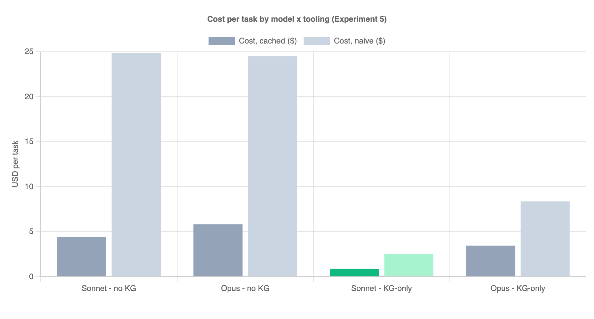
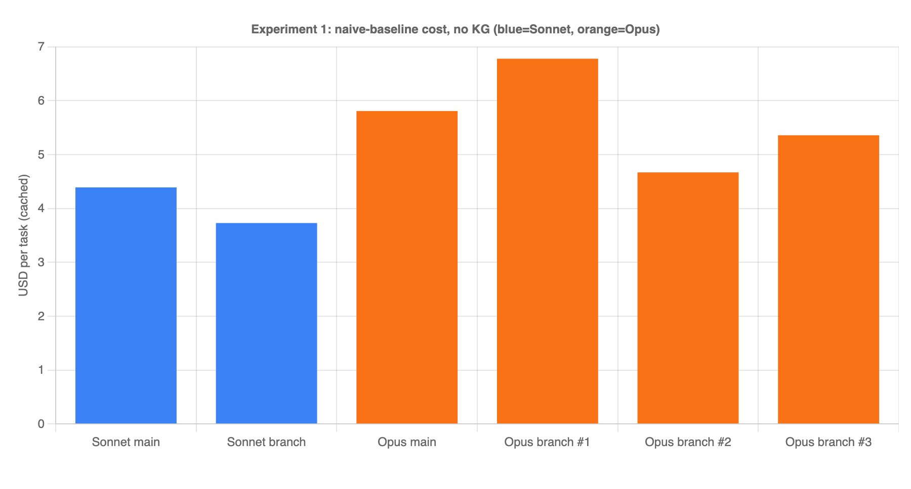
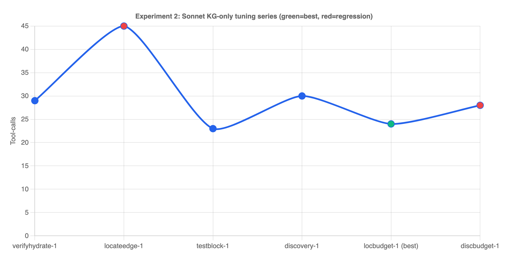
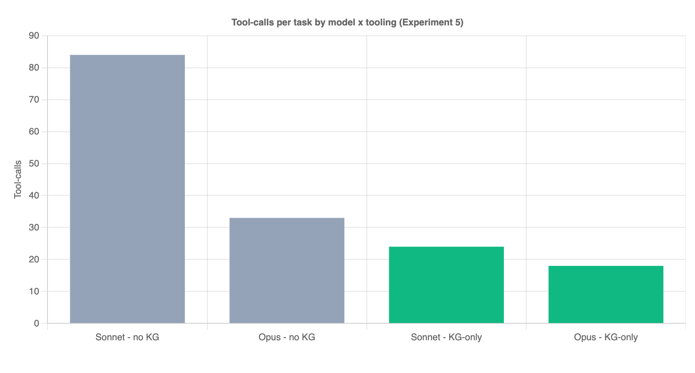
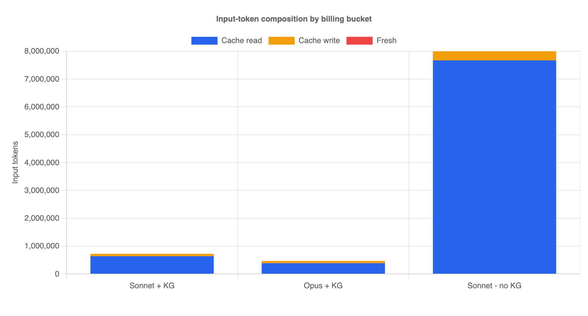
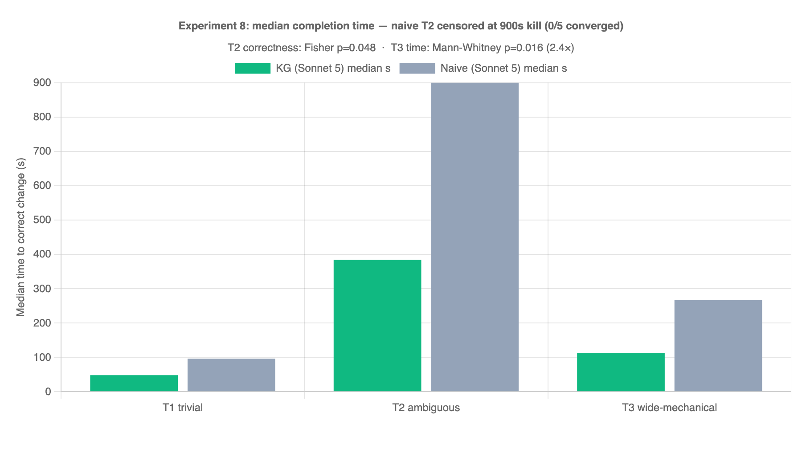
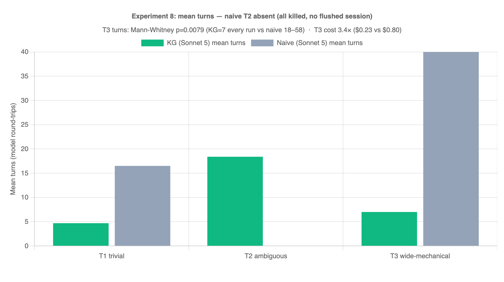

# CodeGraph A/B Experiment — Cutting Agent Cost with a Knowledge Graph

_A production TypeScript/React microapp · knowledge-graph-assisted coding agents · results + playbook_

## TL;DR (for the room)

We tested whether giving a coding agent a **knowledge graph (KG)** of the codebase — instead
of letting it grep/read files — makes it cheaper and faster. Same task, same repo, every kept
result correct + green.

| Agent | tool-calls | tokens | **cost (cached)** | cost (naive) |
| --- | ---: | ---: | ---: | ---: |
| Sonnet · **no KG** | 84 | 8.05M | $4.39 | $24.86 |
| Opus · **no KG** | 33 | 1.56M | $5.81 | $24.49 |
| **Sonnet · KG-only** | **24** | **0.75M** | **$0.86** | **$2.51** |
| Opus · KG-only | 18 | 0.49M | $3.43 | $8.35 |

**Headline:** the KG turned Sonnet from the *most expensive, worst-behaving* option into the
**cost-optimal** one — **~5× cheaper than non-KG Sonnet and ~4× cheaper than KG Opus**, while
matching them on correctness.

- **Optimize for cost → Sonnet + KG** ($0.86).
- **Optimize for fewest turns/latency → Opus + KG** (18 calls) — but ~4× the price.

---

## 1. The task (identical across all cells)

> In the Item Sales widget, change the primary graph series color to `#FF6B6B` and set the line
> width to `3px`. This affects the default/daily chart, the real-time ("Today") chart, and the
> compare-mode chart. Do **not** touch the dashed comparison series. Fix any tests the change
> breaks.

Why this task: it's a realistic "small change, shared code, spooky test fallout" job. The color
lives in a shared source-of-truth (`METRIC_SERIES_COLORS` / `getMetricColors`) consumed by three
chart paths, and the change breaks a parameterized `test.each` invariant — exactly the kind of
thing that makes agents flail.

---

## 2. Method

- **2×2 matrix:** model (Sonnet / Opus) × tooling (naive grep+read / KG-only).
- **KG-only** = the agent has **no grep, no read_file, no list_files, no shell**. All discovery
  goes through a CodeGraph MCP server (`locate`, `plan`, `trace`, `impact`, `read`, `apply`,
  `verify`). Edits + test-runs happen through the same tools.
- Each cell run on an identical clone (same source baseline, same tests), verified green
  (Jest), and scored from the recorded session (tool-calls + token usage).
- **Costs** use each model's real Anthropic rates and the **actual cache buckets** the API
  reported (see §5): Sonnet 3 / 15 / 3.75 / 0.30, Opus 15 / 75 / 18.75 / 1.50 ($/M for
  input / output / cache-write / cache-read).

---

## 3. The big finding: KG-*preferred* doesn't work — it has to be KG-*only*

We also tried a **KG-preferred (suggestive)** agent: KG tools available, but grep/read/shell
left in as a fallback. It sprawled and we killed it. The session tells the story:

> **46 tool calls, only 4 were KG** — the rest were `grep ×26`, `read_file ×14`, `list_files ×2`.

Given the choice, the model bolts straight back to its grep/read comfort zone and **ignores the
graph**, reverting to the ~84-call non-KG baseline. **The starvation is the mechanism, not just
a measurement trick.** Ship KG-*only* agents.

---

## 4. How we got Sonnet+KG from 29 → 24 turns (the iteration log)

The first KG-only Sonnet run was fine but not great. We instrumented every run, found the
bottleneck, shipped a tooling fix, re-ran. The journey (Sonnet, KG-only):

| iteration | turns | tokens | what changed |
| --- | ---: | ---: | --- |
| verifyhydrate-1 | 29 | 1.32M | baseline: verify hydrates the failing assertion into the verdict |
| locateedge-1 | 45 | 3.22M |  regression — enriched `locate` to show caller/referencer names; a `test.each` tail meltdown |
| testblock-1 | 23 | 1.84M | verify hydrates the **enclosing test block** (`test.each` structure) + `test_one` escape hatch |
| discovery-1 | 30 | 0.86M | capped `locate` payload (5 candidates), added a confidence signal + forward `trace` |
| **locbudget-1** | **24** | **0.75M** | **best** — server-side locate budget + looser concept-strong signal |
| discbudget-1 | 28 | 0.98M |  regression — shared discovery budget; reverted (see lesson below) |

### What actually moved the needle (durable wins)
1. **Compact tool output.** `locate` returned ~15 candidates @ ~9KB *every* call, re-transmitted
   each turn. Capping it to the top few + hydrating only the best candidate cut a large,
   turn-multiplied token tax.
2. **Verify hydration.** When a test fails, the verdict now includes the **enclosing test block**
   (e.g. the whole `test.each(METRICS)(...)` with its invariant comment). This collapsed a
   14-call test-fix meltdown into a tight `apply → verify` — the single biggest turn win.
3. **A "trust this" signal.** `locate` now prints `>> STRONG MATCH` when it's confident. Opus
   *acts* on it immediately; Sonnet is more stubborn (see lessons).

### What did NOT work (and why)
- **Mechanical caps just displace work.** We added budgets on `locate`, then `read`, then a
  shared `locate+trace+impact` budget. Each time, the model re-routed around the cap
  (`locate → impact → trace → read`) and hit the *same* total. **Discovery is a ~20-call
  behavioral floor** — the model discharges a fixed "orientation quota" regardless. We reverted
  the shared discovery budget.
- **Lesson:** invest in **displacement-proof** levers (smaller payloads, richer verdicts), not
  in caps that just move the same calls to a different tool.

---

## 5. Why "cost (cached)" is the real number

Every run used Anthropic **prompt caching**, and the API's own usage counters prove it — the vast
majority of "input" tokens are cheap cache-*reads*, not full-price fresh tokens:

| run | total input | cache **read** | cache **write** | truly fresh |
| --- | ---: | ---: | ---: | ---: |
| Sonnet + KG | 724,437 | 635,118 (**88%**) | 89,281 | 38 |
| Opus + KG | 467,068 | 386,883 (**83%**) | 80,159 | 26 |
| Sonnet · no KG | 7,994,269 | 7,670,217 (**96%**) | 323,882 | 170 |

- **`cost cached`** = the real bill (cache-reads billed at ~10% of input price). **Use this.**
- **`cost naive`** = hypothetical "if caching were off" (all input at full price). Same run, worst case.
- You pay **one or the other**, never the sum.

**Key economic insight:** because ~90% of input is cheap cache-reads, the dollar drivers are
**output tokens + cache-writes**, both of which scale with **number of turns**, not payload size.
**So cost is set by turn count.** That's why the whole optimization effort targeted turns.

_(Note: at the non-KG baseline, Opus and Sonnet cost about the same — Opus's token-efficiency
cancels its 5× price. KG breaks the tie: once tokens shrink, the per-token price gap dominates and
the cheaper model, Sonnet, wins decisively.)_

---

## 6. Model behavior notes (useful for picking one)

- **Opus is the better *agent*** — fewest calls (18) and tokens (0.49M) in every condition; it
  reads the `STRONG MATCH` signal and edits immediately.
- **Sonnet flails more without structure** — worst baseline (84 calls); it ignored `STRONG
  MATCH` and over-explored. **But** the KG closes that gap enough that its 5× lower price wins on cost.
- **Correct scope can be *harder*.** The tight, correct edit (only `totalGMV`) triggered a
  parameterized-invariant test that the *sloppy* all-metrics edit sidestepped. Good scoping isn't
  always the easy path — the tooling has to help with the test fallout, which is what verify
  hydration does.

---

## 7. Recommendation & what shipped

- **Default to `kg-sonnet`** for scoped changes; reach for `kg-opus` when you want the fewest
  round-trips and don't mind paying. **Pin the model explicitly** — see §8; `kg-sonnet` ships on
  `claude-5-sonnet` (a silent drift to `claude-4-6-sonnet` measurably regressed correctness & cost).
- **Ship KG-only, never KG-preferred.**
- The reusable MCP server + edit-loop CLIs live in this repo (`codegraph-ext/`), driven by two
  KG-only agents (a cost-optimal "sonnet" cell and a fewest-turns "opus" cell). See the
  [README](../README.md) to point them at any repo.

### Caveats (state them if asked)
- **Most cells are n = 1**, though the Sonnet KG-only cell is now **n = 3 per model** (§8). Sonnet
  has real run-to-run variance (we saw $0.71–$3.20 across KG runs). The 4× cross-model cost gap
  dwarfs that band, so the *ranking* is robust; other cells still want a 3–5× batch to publish tight
  mean ± spread.
- The KG doesn't model **JSX/prop edges** — `trace` from a widget can dead-end where a value flows
  through a component prop; the workaround is to trace from the shared component's config symbol.

---

## 8. Model-sensitivity replication (n=3, fixed KG scaffold)

Holding the KG scaffold **completely fixed** (same KG-only agent `ab-sonnet-kgonly-tight`, same
clone, same task, system prompt **SHA-256-identical** including the sandbox lock), we varied only
the model and ran each n=3. Correctness was adjudicated by the harness (independent diff + scope
count + fresh un-memoized test run) — **never** the agent's self-report.

| Model | Correct | Mean turns | Mean tokens | Mean cost (cached) |
|---|---|---|---|---|
| `claude-5-sonnet`  | **3/3 (100%)** | **22** | **770K** | **$0.84** |
| `claude-4-6-sonnet`| 2/3 (67%)      | 29 (correct runs) | 971K | $1.06 (correct runs) |

**Sonnet 5 wins on every axis** — 100% vs 67% correct, ~32% fewer turns, ~26% cheaper per success.
The KG index/augmentation/prompt were provably unchanged (SHA match); the **model swap alone**
explained the regression that kicked off this whole investigation (a shipped agent's model pin had
silently drifted to 4.6).

### Failure taxonomy (the dangerous part)
Both 4.6 failures would pass a naive “did it say it passed?” gate:
- **Green-but-wrong (scope over-reach):** one 4.6 run recolored **all 4 metrics** yet tests were
  **149/149 PASS** — no test asserts the *other* metrics keep their colors (coverage gap). `verify`
  answers “did I break covered behavior?”, not “did I change *exactly* what was asked?”
- **Fabricated FINAL ANSWER:** an earlier 4.6 attempt listed color edits to files its tool trace
  never touched and claimed a `verify` PASS it never called; the diff + real test run contradicted it.

Neither mode appeared in any Sonnet 5 run. **Consequence: the success signal must come from the
harness, not the subject** — and pair `verify` with a scope check for value/scoped edits.

## 9. When does KG help? Ambiguity vs. blast radius (n=5)

Every section above fixed the *task* and varied the *tooling/model*. This one fixes the model
(`claude-5-sonnet` on **both** arms — a clean tooling-only contrast) and varies the *task shape*
along two axes to ask **which kinds of change KG actually helps with**. Three tiers, KG-only
(`ab-sonnet-kgonly-tight`) vs naive (grep/read/shell, `ab-main-sonnet`), **n=5 per cell**, head-less,
**15-min hard kill** (a kill = a "failed to converge" data point), oracle-adjudicated.

| Tier | Change | Blast radius | Scope ambiguity |
|---|---|---|---|
| **T1 trivial** | one shared fill-opacity constant 0.4→0.55 | 1 file | none |
| **T2 ambiguous** | recolor the "primary graph series" (GMV) + stroke width | ~2 files | **high** (which metric? shared stroke vs scoped color? legacy palette?) |
| **T3 wide-mechanical** | tooltip bg `#002242`→`#013A63` everywhere except redesign branch | 4 files | low (uniform find-and-replace) |

**Correctness (n=5, oracle-adjudicated):**

| Tier | KG | Naive |
|---|---|---|
| T1 trivial | 3/3 | 2/2 |
| T2 ambiguous | **4/5** (1 green-but-wrong) | **0/5** (5/5 timed out) |
| T3 wide-mechanical | 5/5 | 5/5 |

**Time to correct change (s):** T1 KG med 48 vs naive 96 · T2 KG med 384 vs naive **≥900 (censored,
killed)** · T3 KG med 113 vs naive 267.

**In the paper's own currency (turns / tokens / $), recovered from recorded sessions** — turns drive
cost (§5). Killed runs are never flushed to disk, so naive T2 has no turn data (converged tiers only):

| Tier | Arm | Turns (mean / raw) | Tokens (mean) | $ (mean) |
|---|---|---|---|---|
| T1 | KG | 4.7 (4,5,5) | 67K | $0.076 |
| T1 | naive | 16.5 (13,20) | 348K | $0.249 |
| T2 | KG | 18.4 (13,17,19,21,22) | 915K | $0.922 |
| T2 | naive | — all 5 killed, no flush — | | |
| T3 | KG | **7.0 (7,7,7,7,7)** | 171K | **$0.231** |
| T3 | naive | **40.0 (18,37,43,44,58)** | 1.42M | **$0.796** |

**Significance:**
- **T2 correctness — Fisher's exact 2-sided: p = 0.0476 (significant).** `[[4,1],[0,5]]`. Landed on
  the razor's edge: with KG at 4/5, naive had to be a clean 0/5 to clear α=0.05 — and it was.
- **T3 efficiency — Mann-Whitney (exact, 2-sided): turns U=0 p = 0.0079; time U=1 p = 0.0159.** Turns
  is the cleaner signal *and* the cost driver: KG spent **exactly 7 turns on all 5 runs** (zero
  variance) vs naive 18–58 — perfect separation. In $: **$0.23 vs $0.80 = 3.4×**, at identical 5/5
  correctness. (Wall-clock 2.4× is noisier — one naive run hit 116s, overlapping KG's range.)
- **T1 — genuine null, uncertifiable at n=3/2** (min achievable p = 0.20 regardless of separation).

**The mechanism (revises the blast-radius intuition):** KG's payoff tracks **scope ambiguity, not
fan-out.** T3 has the *widest* fan-out yet naive nails it 5/5 — just **3.4× costlier ($0.80 vs $0.23)**
and ~5.7× the turns (40 vs 7); notably KG spent **exactly 7 turns every run** (graph makes discovery
deterministic) while naive ranged 18–58 (a dice roll). T2 has *narrow* fan-out but real interpretive
choice, and it's the only tier where naive fails outright — by **never converging** (unstructured
grep/read exploration; one run hit the framework's context-compaction spiral before the kill). On
mechanical work KG buys cost+consistency; on ambiguous work it's the difference between finishing and
timing out; on trivial work it's neither.

**Caveats:** the T2 win is *non-convergence*, not wrong-answer (the 15-min budget is part of the
claim); KG still threw 1/5 green-but-wrong (reduces ≠ eliminates the ambiguity failure mode); an early
T3 run false-failed on missing compiled Lingui locales (environment gap) — recompiled, discarded,
re-ran clean, excluded from figures; still one repo/one model. The harness and raw `results.jsonl`
are kept privately; p-values computed by exact enumeration.

**Extended-budget follow-up (is naive slow, or stuck?):** the most-attackable line above is the 15-min
wall. We re-ran naive T2 on a clean clone at **3× the budget — a 45-min hard kill**, same task/oracle/
model. Result: **0/2 converged.** r6 ran the full 45 min (2 context-compaction spirals, summarizing 42
then 69 older messages) with 0 applied change; r8 ran the full 45 min, reached the correct shared fn
`createSingleSeries` (~min 38) and fired one edit that silently no-op'd (`git diff` empty). (A third
run was excluded — cut short by an org-wide 429 token-quota event, not the kill.) **Verdict: naive is
stuck, not slow** — extending the headline from "0/5 in 15 min" to "0/2 with 3× the runway." The failure
is structural discovery (rediscover→lose→rediscover across compaction boundaries), not throughput; every
KG T2 run converged in a median 384s, ~1/7 of the budget naive exhausted without a diff. A side-by-side
replay of one KG vs one naive run (built from the real transcripts) was recorded as a side-by-side
screencast (kept with the private harness).

---

_Generated from recorded agent sessions. The experiment harness and raw session logs are kept
privately; the numbers above are reproduced verbatim from those recordings._

---

## Figures

